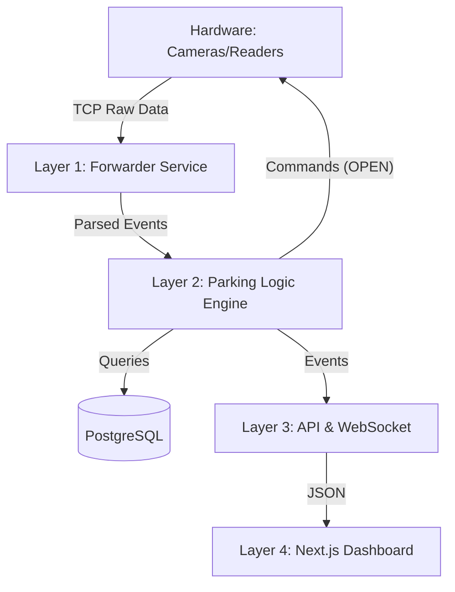

***

# 🅿️ PROJECT CONTEXT: ParkingOS v3.0 (Enterprise SaaS)

**ROLE:** Act as a Senior Software Architect & Lead Full-Stack Developer.
**GOAL:** We are building a scalable, white-label Smart Parking System (SaaS) capable of managing anything from small private lots to international airports.

***

## 1. 🌍 BUSINESS OVERVIEW (The "What" and "Why")

**Product Vision:** A unified platform for access control, capacity management, and billing in the parking industry.
**Key Difference:** Unlike traditional systems that are hard-coded for specific hardware/clients, ParkingOS is **configuration-driven**. Everything (roles, validation rules, zone hierarchy) is defined in the database at runtime.

**Target Clients:**
1.  **Airports/Malls:** Complex nested zones, mixed user types (staff, VIP, public).
2.  **Companies (B2B):** Tenant management (Company A rents 20 spots).
3.  **Private Lots:** Simple gate control, payment integration.

**Core Use Cases:**
*   **Mixed Access:** A single gate handles RFID (Staff), LPR (Subscribers), and QR Tickets (Public) simultaneously.
*   **Dynamic Roles:** Administrator creates roles like "Night Shift", "VIP", "Delivery" with granular permissions.
*   **Toggle Validation:** Every rule (e.g., "Check Capacity", "Anti-Passback") can be toggled ON/OFF per Zone, Gate, or User Group instantly.

***

## 2. 🏗️ SYSTEM ARCHITECTURE (The "How")

### A. Tech Stack
*   **Backend:** Python 3.11+ (Flask Framework)
    *   *Why:* Fast prototyping, excellent TCP handling, rich IoT libraries.
*   **Database:** PostgreSQL 15+ (SQLAlchemy ORM)
    *   *Why:* Robust relational data, reliable ACID transactions for billing.
*   **Frontend:** Next.js 14+ (TypeScript, Tailwind CSS)
    *   *Why:* Server-Side Rendering (SEO), modern UI components, fast performance.
*   **Real-time:** Socket.IO
    *   *Why:* Live dashboard updates (gate status, log feed) with sub-second latency.
*   **Protocol:** Custom TCP Forwarder
    *   *Mechanism:* Hardware sends raw strings `DEVICE_IP:PORT PAYLOAD` to our server ports (7000/7001).

### B. Layered Design


***

## 3. 💾 DATABASE SCHEMA (V3.0 Design)

The database must support the "Configuration-Driven" approach.

### 1. Identity & Access (RBAC)
*   **`roles`**: `id`, `name`, `permissions` (JSON or Boolean flags like `can_ignore_capacity`).
*   **`tenants`**: `id`, `name`, `quota_limit`.
*   **`users`**: `id`, `name`, `role_id`, `tenant_id` (nullable).
*   **`credentials`**: `id`, `user_id`, `type` (RFID/LPR/QR), `value`, `is_active`.

### 2. Spatial & Hardware
*   **`zones`**: `id`, `name`, `capacity`, `parent_zone_id` (Self-referential for infinite nesting).
*   **`gates`**: `id`, `name`, `zone_from_id`, `zone_to_id`, `is_active`.
*   **`devices`**: `id`, `gate_id`, `ip_address`, `type`, `config` (JSON).

### 3. Logic Configuration
*   **`validation_rules`**: This is the heart of flexibility.
    *   `scope`: 'GLOBAL', 'ZONE', 'GATE', 'ROLE'.
    *   `target_id`: ID of the zone/gate/role.
    *   `rule_type`: 'CHECK_CAPACITY', 'CHECK_SCHEDULE', 'CHECK_PAYMENT', 'CHECK_ANTIPASSBACK'.
    *   `is_enabled`: Boolean.

***

## 4. 🧠 LOGIC FLOW (The "Decision Engine")

When a scan arrives (`RFID: 12345` at `Gate: Main Entry`), the system must:

1.  **Resolve Context:**
    *   Who is user `12345`? -> *Marko (Role: VIP)*.
    *   Where is he? -> *Main Entry (Zone: Garage Level 1)*.
2.  **Load Rules:** Fetch active `validation_rules` for this Gate + this Zone + Global defaults.
3.  **Execute Validation Chain:**
    *   *Step 1 (Status):* Is User Active? -> YES.
    *   *Step 2 (Schedule):* Is rule `CHECK_SCHEDULE` on? -> YES. Does Marko satisfy it? -> YES.
    *   *Step 3 (Capacity):* Is rule `CHECK_CAPACITY` on? -> YES.
        *   *Role Check:* Does Marko have `can_ignore_capacity`? -> **YES**. -> **SKIP CHECK**.
    *   *Step 4 (Tenant):* Is he part of a Tenant? -> NO. -> SKIP.
4.  **Decision:** **ALLOW**.
5.  **Side Effects:**
    *   Send TCP "OPEN" command to Gate.
    *   Create `Session` record in DB.
    *   Emit `socket.emit('access_log', ...)` to Frontend.

***

## 5. 📂 CURRENT FILE STRUCTURE

```text
/backend
  ├── app.py                 # Entry point (Flask + SocketIO)
  ├── config.py              # Env vars (Ports, DB URL)
  ├── models.py              # SQLAlchemy Models (Needs update to V3.0)
  ├── /services
  │   ├── forwarder_tcp.py   # TCP Listener (Hardware Interface)
  │   └── parking_logic.py   # The Decision Engine (Needs update)
  ├── /api
  │   ├── routes_gates.py    # REST API for Gates
  │   └── routes_cards.py    # REST API for Users
/frontend (Next.js)
  ├── /src/app               # App Router pages
  ├── /src/components        # React components
```

***

## 6. 🚀 IMMEDIATE TASKS (What to do next?)

**Priority 1: Database Refactoring**
*   Update `models.py` to implement the V3.0 schema (Roles, Rules, Hierarchical Zones).

**Priority 2: Logic Engine Update**
*   Rewrite `parking_service.py` to use the new `validation_rules` table instead of hardcoded checks.

**Priority 3: Dashboard V2**
*   Build the Frontend Interface for managing these Rules and Roles.

***

**INSTRUCTIONS FOR AI:**
Use the information above as the absolute source of truth. Do not hallucinate features outside of this scope unless asked. Focus on writing clean, modular, and type-safe code. Start by acknowledging you understand the V3.0 architecture.